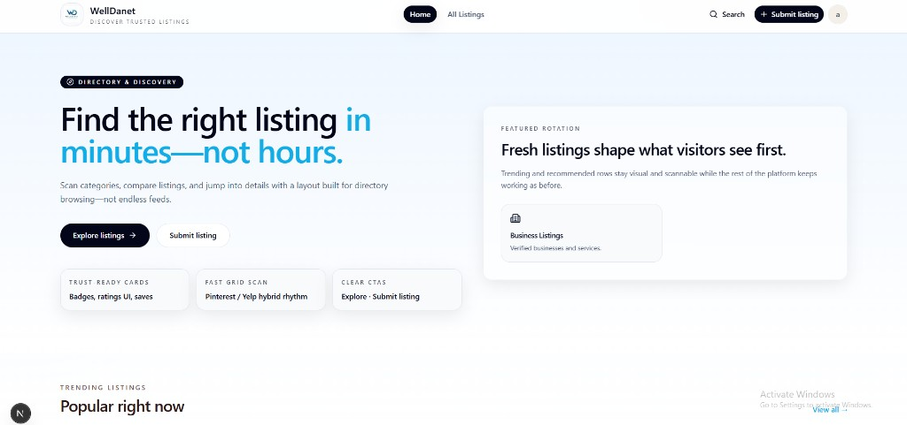
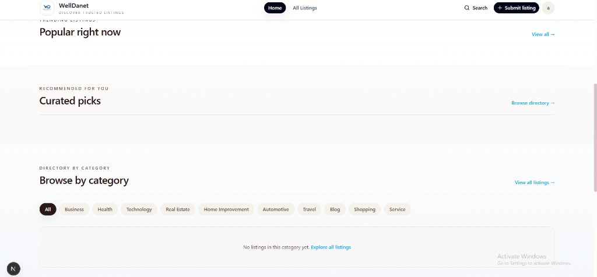
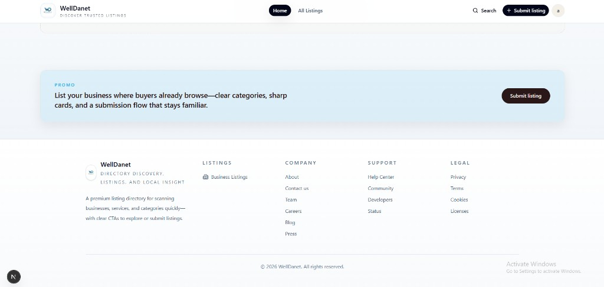
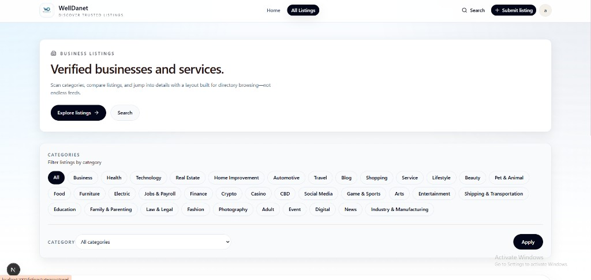
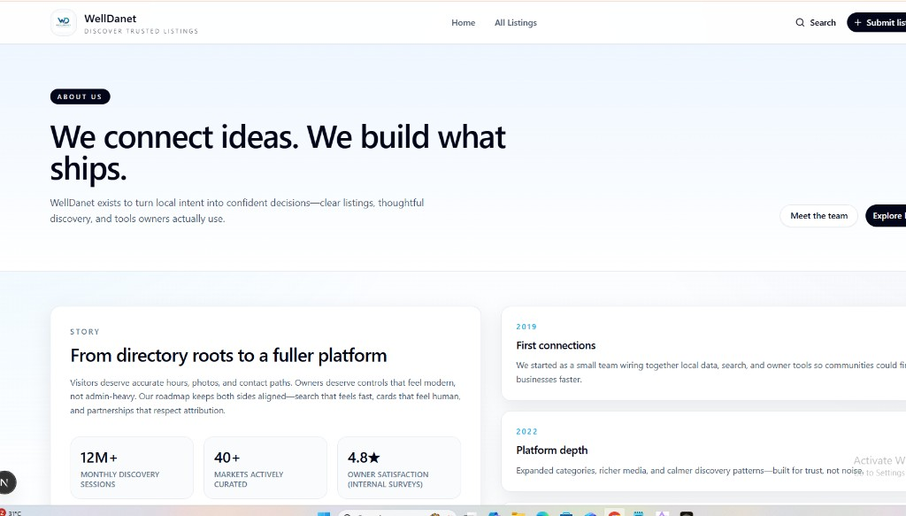
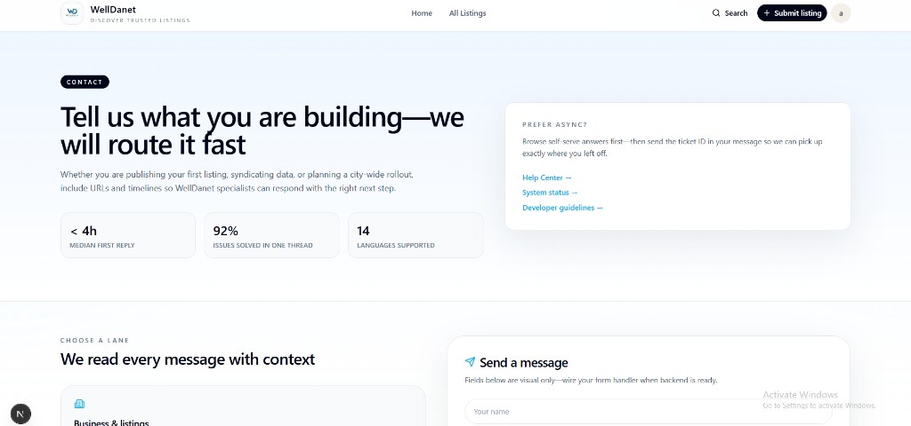

# WellDanet

Directory and discovery platform for trusted listings—built with Next.js.

## UI screenshots

### Home — hero

### Home — trending, curated picks, and categories

### Home — promo and footer

### Business listings directory

### About

### Contact

---

Images are stored under [`docs/readme-screenshots/`](docs/readme-screenshots/) so they load inline when this file is viewed on GitHub.
